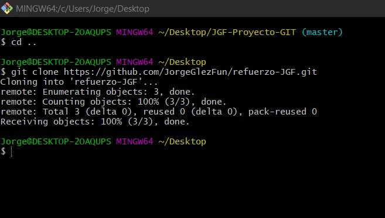

# refuerzo-JGF

1. Creamos el repositorio
    

2. Clonamos el repositorio
    

3. Creamos el README
    

4. Hacemos el commit inicial
    ```
    $ git add .
    $ git commit -m "commit inicial"
    ```

5. Hacemos el push inicial
    ```
    $ git push
    ```
6. Ignoramos los archivos.

    a)
    ```
    $ touch privado.txt
    ```
    b)
    ```
    $ mkdir privada
    ```
    c)
    ```
    $ echo "privado.txt" > .gitignore
    $ echo "privado/" >> .gitignore
    ```
7. Añadimos el fichero
    ```
    $ touch 1.txt
    ```
8. Creamos el tag
    ```
    $ git tag -a v0.1 -m "8. Creamos el tag"
    ```
9. Subimos el tag
    ```
    $ git push --tags
    ```
10. Mostramos la cuenta de GitHub

11. Hacemos un uso social de GitHub

12. Creamos una tabla en GitHub

13. Ponemos a "antvazcar" como colaborador de refuerzo en GitHub