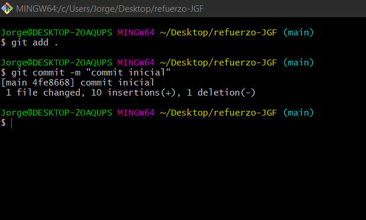
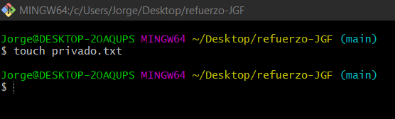
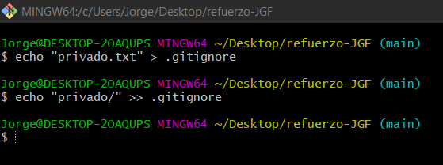
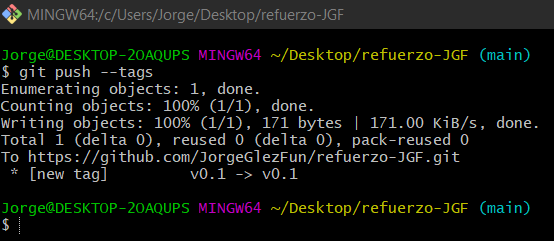
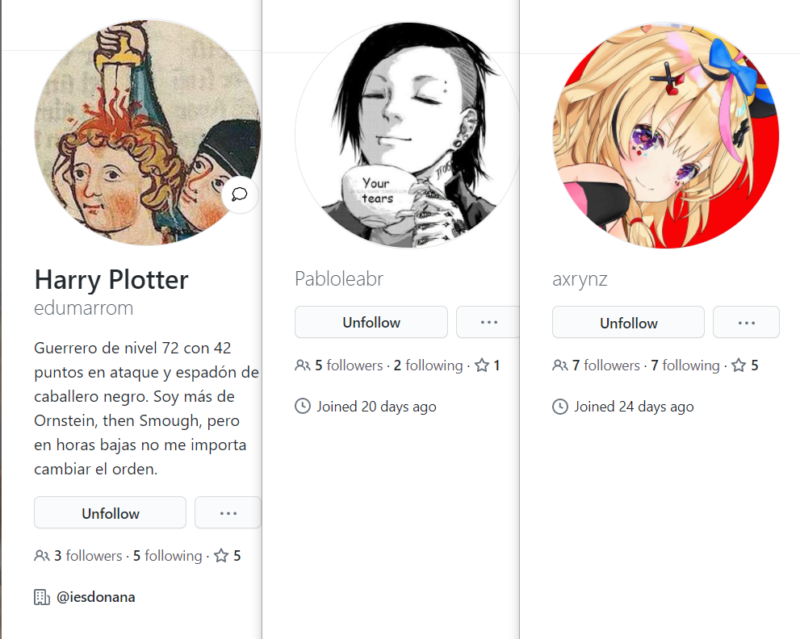

# refuerzo-JGF

1. Creamos el repositorio
    

2. Clonamos el repositorio
    

3. Creamos el README
    

4. Hacemos el commit inicial
    ```
    $ git add .
    $ git commit -m "commit inicial"
    ```
    
5. Hacemos el push inicial
    ```
    $ git push
    ```
    
6. Ignoramos los archivos.

    a) Creamos el archivo privado.txt
    ```
    $ touch privado.txt
    ```
    

    b) Creamos la carpeta
    ```
    $ mkdir privada
    ```
    

    c) Hacemos los cambios oportunos para que el archivo y la carpeta sean ignorados por git 
    ```
    $ echo "privado.txt" > .gitignore
    $ echo "privado/" >> .gitignore
    ```
    
7. Añadimos el fichero
    ```
    $ touch 1.txt
    ```
    
8. Creamos el tag
    ```
    $ git tag -a v0.1 -m "8. Creamos el tag"
    ```
    
9. Subimos el tag
    ```
    $ git push --tags
    ```
    
10. Mostramos la cuenta de GitHub

    a) Nos ponemos una foto de perfil en GitHub
    

11. Hacemos un uso social de GitHub

    a)
    
    
    b)
    
    c)
    
12. Creamos una tabla en GitHub

| Nombre |  Enlace GitHub
| ------------- | ------------- |
| Pablo Leal  | https://github.com/Pabloleabr  |
| Laura Álcon  |  https://github.com/axrynz |
| Eduardo Martínez | https://github.com/edumarrom |
13. Ponemos a "antvazcar" como colaborador de refuerzo en GitHub